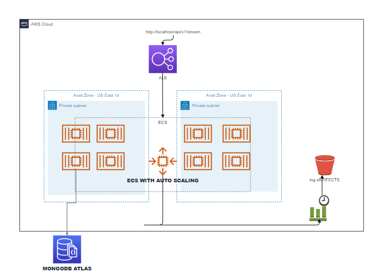

<h1 align="center">Welcome to Lightning Crawler 👋</h1>
<p>
  
  <a href="https://github.com/ChiromboKenT/count-active-streams#readme" target="_blank">
    
  </a>
  
</p>

> Scalable API that checks and counts the number of active streams a viewer has

### 🏠 [Homepage](https://github.com/ChiromboKenT/count-active-streams#readme)

## Reference architecture



## Prerequisites

Download and install the latest version of Docker Desktop.

- [Download for Mac](https://docs.docker.com/desktop/mac/install/)
- [Download for Windows](https://docs.docker.com/desktop/windows/install/)

For development, you will only need Node.js and a node global package, npm, installed in your environement.

- Docker
  To deploy to production You need an AWS Account

### Node

- #### Node installation on Windows

  Just go on [official Node.js website](https://nodejs.org/) and download the installer.
  Also, be sure to have `git` available in your PATH, `npm` might need it (You can find git [here](https://git-scm.com/)).

- #### Node installation on Ubuntu

  You can install nodejs and npm easily with apt install, just run the following commands.

      $ sudo apt install nodejs
      $ sudo apt install npm

If the installation was successful, you should be able to run the following command.

    $ node --version
    v16.11.3

    $ npm --version
    6.1.0

### Install

```sh
 (cd count-active-streams && npm install)

```

## Usage Locally

### Run Backend

- Navigate to count-active-streams folder

```sh
  cd count-active-streams && npm run dev
```

### Open Application

- Open application on <a href="http://127.0.0.1:5000/" target="_blank">http://localhost:5000/</a>

## Usage Docker Locally

```sh
##Locally
docker-compose -f docker-compose.yml -f docker-compose.dev.yml up -d --build

```

### Open Application

- Open application on <a href="http://127.0.0.1:80/" target="_blank">http://localhost:80/</a>

## Deploying to AWS ECS

### Requirements

    - Have an AWS Account
    - To ensure that Docker ECS integration is allowed to manage resources for your Compose application, you have to ensure your AWS credentials has at least the following permissions:
        application-autoscaling:*
        cloudformation:*
        ec2:*
        ecs:*
        elasticloadbalancing:*
        iam:AttachRolePolicy
        iam:CreateRole
        iam:DeleteRole
        iam:DetachRolePolicy
        iam:PassRole
        logs:CreateLogGroup
        logs:DeleteLogGroup
        logs:DescribeLogGroups
        logs:FilterLogEvents
        route53:*
        servicediscovery:*

### Step 1

create an Amazon ECS Docker context named myecscontext

```sh
  docker context create ecs myecscontext
```

```sh
  docker context use myecscontext
```

### Step 2

    In order to deploy this application on ECS, we need to have the images for the application frontend and backend stored in a public image registry such as Docker Hub. This enables the images to be pulled from anywhere.

    Build Image with docker compose
    ```sh
    docker-compose build
    ```

    Before pushing ensure that you are logged in to docker hub
    ```sh
    docker login
    ```
    Push

### Step 3

- Run a Compose application
- Ensure you are using your ECS context. You can do this either by specifying the --context myecscontext flag with your command, or by setting the current context using the command docker context use myecscontext

```sh
##Deploy using compose up
docker compose -f docker-compose.yml -f docker-compose.prod.yml up

```

## Running API

[Link to documented API](https://documenter.getpostman.com/view/18723086/Uz5NkZ2u)

## Author

👤 **Kenny Chirombo**

- Github: [@ChiromboKenT](https://github.com/ChiromboKenT)
- LinkedIn: [@chirombokenny](https://linkedin.com/in/chirombokenny)

## 📝 License

Copyright © 2022 [Kenny Chirombo](https://github.com/ChiromboKenT).<br />
This project is [ISC](https://github.com/ChiromboKenT/count-active-streams/blob/master/LICENSE) licensed.

---

_This README was generated with ❤️ by [readme-md-generator](https://github.com/kefranabg/readme-md-generator)_
